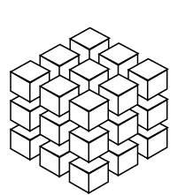
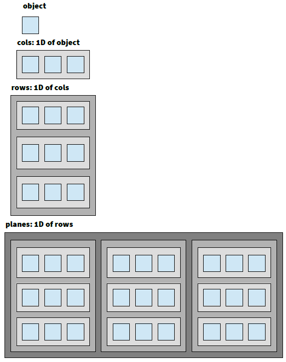

---
mep: 112  
title: Multidimensional Arrays  
layout: mep   
authors: Christohper Felton, Daniel van der Schuur, Josy Boelen  
status: Draft  
date: 2015-07-30  
---  

Multidimensional Arrays
========================

As of 0.9 (dev) MyHDL has a limitation compared to Verilog and 
VHDL.  Both Verilog and VHDL support multidimensional arrays.
MyHDL does not directly support multidimensional array conversion.  
In the HDL context an array is typically a homogeneous collection
of multi-bit vector types.

<!-- 
  need some term definition on vectors and arrays, and introduction
  and links to the list-of-signal (LoS) documentation.
-->

It should be noted that multidimensional list-of-signals work in 
modelling (except for tracing the list-of-signals itself) and thus it is mostly a conversion issue.

VHDL Arrays
-----------
VHDL has many abstraction tools and multidimensional arrays has
existed in VHDL from the beginning.

### VHDL Multidimensional Example
The following is a variant of a multidimensional array example
extracted from ./vhdl_example.vhd.  This example demonstrates how multidimensional arrays 
can be created in VHDL. 
    
```vhdl
  type t_cube is array (3 downto 0, 3 downto 0, 3 downto 0) of unsigned(31 downto 0);
  signal mdarray : t_cube;  

-- accessing the array
process begin
    -- ...
    if (wr = '1') then
      mdarray(islc, irow, icol) <= data_i;
    else
      data_o <= mdarray(islc, irow, icol);
    end if; 
end
```

#### Synthesis results

| Tool |logic |registers |BRAM |Pins |Fmax|
| ---- |----- |--------- |---- |---- |----|
| A    |1024  |2080      |0    |73   |220 |

**Note** that there was no RAM inferred, as the coding style doesn't match the inference template. The example shown may mislead you that RAM inference was anticipated.
But this multi-dimensional array allows for both accessing and updating all elements at the same time, which is totayly different than a RAM where we typically can only access one location at a time. A good example is [convolution](http://docs.gimp.org/en/plug-in-convmatrix.html) where a  a 3 x 3 matrix is used.


### Another VHDL Multidimensional Example
Another way to declare a multidimensional array is to declare subtypes iteratively:
```VHDL
	type cols   is array (3 downto 0) of unsigned(31 downto 0);
	type rows   is array (3 downto 0) of cols;
	type planes is array (3 downto 0) of rows;
	signal tcube : planes;

begin
	process(clock)
	begin
		if (rising_edge(clock)) then
			if (wr = '1') then
				tcube(slc)(row)(col) <= data_i;
			end if;

			data_o <= tcube(slc)(row)(col);
		end if;
	end process;
```
###  Comparing the two different implementations
#### At the VHDL Level
The _true_ 3D type,
```VHDL
type t_cube is array (2 downto 0, 2 downto 0, 2 downto 0) of unsigned(31 downto 0)
``` 
can be seen as a cube, depicted in this picture:   



The _nD_-type can be easily used as a module port because the _fully unconstrained_ type declaration ```type cube is array (natural range <>, natural range <>, natural range <>) of unsigned; -- VHDL2008!```
can be declared in a _general_ VHDL _package_. 
But updating (assigning a new value to) each element must be done atomically, e.g.:
```VHDL
type t_col  is array (2 downto 0) of unsigned(31 downto 0)
type t_cube is array (2 downto 0, 2 downto 0, 2 downto 0) of unsigned(31 downto 0)
signal ndarray : t_cube;
signal col : t_col;

-- updating the row 0 of plane 0
ndarray( 0, 0 ) <= col ; 				-- error, missing lowest index for ndarray
ndarray( 0, 0, 2 downto 0 ) <= col ; 	-- illegal, (type mismatch)

for i in 0 to 2 loop
	ndarray(0,0,i) <= col(i) ; 			-- correct
end loop ;
```
    

In contrast the _stacked_ 1D x 1D x 1D type 
```VHDL
type cols   is array (2 downto 0) of unsigned(31 downto 0);
type rows   is array (2 downto 0) of cols;
type planes is array (2 downto 0) of rows;
```
has a rather flat representation.  The picture show how we get to an eventual 1Dx1Dx1D of _object_



Note that we stacked the objects horizontally and vertically in an alternating manner. This way we can easily show even more than 3 dimensions.  
Accessing a _stacked_ m1D type is a lot more versatile, as
```VHDL
type cols   is array (2 downto 0) of unsigned(31 downto 0);
type rows   is array (2 downto 0) of cols;
type planes is array (2 downto 0) of rows;
signal tcube : planes;
signal row   : rows;
signal col   : cols;

tcube(0)(0) <= col ;   -- valid
tcube(1)    <= row ;   -- valid
tcube(2)(1) <= row(2); -- valid
```

#### At the RTL Level
At least in Quartus II, after Analysis and Synthesis, there is **no difference** between the RTL Schematics!  


Verilog Arrays
--------------
In the Verilog 2001 standard (1394-2001) multi-dimensional arrays
were added [reference].  Prior to this multi-dimensional arrays 
were not supported and many open-source Verilog simulators still
do not support multi-dimensional arrays [reference].  Although there
is limited support in the open-source tools the 2001 standard is 
over 10 years old and commonly used by many developers.

### Verilog Multidimensional Example

```verilog
module m1Dcube
(
	input we, clk,
	input [1:0] a2, a1, a0,
	input [31:0] data, 
	output reg [31:0] q 
	);
	
	reg [31:0] cube[3:0][3:0][3:0]; // # words = 1 << address width
	integer l, k, j;
	
	always @(posedge clk)
	begin
		// writing
		if ( we )
			cube[a2][a1][a0] <= data;
		// reading						
		q <= cube[a2][a1][a0];
	end
endmodule
```

#### Synthesis results

| Tool       |logic |registers |BRAM |Pins |Fmax|
| ---------- |----- |--------- |---- |---- |----|
| A 15.0 C4E |1442  |2080      |0    |72   |233 |

<!-- include synthesis results for vhdl and verilog -->

MyHDL List-of-Signals (Array)
-----------------------------

We will use the _m1D_ moniker to refer to the generic Python multidimensional lists.
These _m1D_ lists will be accessed using the standard stacked _[]_  
Currently _m1D_ objects are supported in modelling but with the limitation that they are not visible in the traced signals.
Conversion is not functional.

```python
def m1Dcube( Clk, Reset, A0, A1, A2, D , Wr , Q):
    ''' a small example to test the m1D experimental implementation '''

    cube = [[[ myhdl.Signal(myhdl.intbv(l*9+k*3+j+1)[len(D):]) for j in range(3)] for k in range(3)] for l in range(3)]
    
    @myhdl.always_seq( Clk.posedge, reset = Reset)
    def fill():
        for l in range(3):
            for k in range(3):
                for j in range(3):
                    if A2 == l and A1 == k and A0 == j and Wr:
                        cube[l][k][j].next = D
        
    @myhdl.always_comb
    def calc():
        cubesum = myhdl.intbv(0)[len(Q):]
        for l in range(3):
            for k in range(3):
                for j in range(3):
                    cubesum += cube[l][k][j]
        Q.next = cubesum
        
    return fill, calc
``` 
This implementation makes use of  the standard Python (multi-)list comprehension.  
Currently assignments are atomical (or singular) as MyHDL doesn't support assignments to a list.

(using experimental code) gets us the following VHDL:

```VHDL
entity m1Dcube is
	port(
		Clk   : in  std_logic;
		Reset : in  std_logic;
		A0    : in  unsigned(1 downto 0);
		A1    : in  unsigned(1 downto 0);
		A2    : in  unsigned(1 downto 0);
		D     : in  unsigned(7 downto 0);
		Wr    : in  std_logic;
		Q     : out unsigned(12 downto 0)
	);
end entity m1Dcube;
-- a small example to test the m1D experimental implementation 

architecture MyHDL of m1Dcube is
	type t_array_cube_0 is array (0 to 3 - 1) of unsigned(7 downto 0);
	type t_array_cube_1 is array (0 to 3 - 1) of t_array_cube_0;
	type t_array_cube is array (0 to 3 - 1) of t_array_cube_1;
	signal cube : t_array_cube;

begin
	M1DCUBE_FILL : process(Clk, Reset) is
	begin
		if (Reset = '1') then
			cube(0)(0)(0) <= to_unsigned(1, 8);
			cube(0)(0)(1) <= to_unsigned(2, 8);
			cube(0)(0)(2) <= to_unsigned(3, 8);
			cube(0)(1)(0) <= to_unsigned(4, 8);
			cube(0)(1)(1) <= to_unsigned(5, 8);
			cube(0)(1)(2) <= to_unsigned(6, 8);
			cube(0)(2)(0) <= to_unsigned(7, 8);
			cube(0)(2)(1) <= to_unsigned(8, 8);
			cube(0)(2)(2) <= to_unsigned(9, 8);
			cube(1)(0)(0) <= to_unsigned(10, 8);
			cube(1)(0)(1) <= to_unsigned(11, 8);
			cube(1)(0)(2) <= to_unsigned(12, 8);
			cube(1)(1)(0) <= to_unsigned(13, 8);
			cube(1)(1)(1) <= to_unsigned(14, 8);
			cube(1)(1)(2) <= to_unsigned(15, 8);
			cube(1)(2)(0) <= to_unsigned(16, 8);
			cube(1)(2)(1) <= to_unsigned(17, 8);
			cube(1)(2)(2) <= to_unsigned(18, 8);
			cube(2)(0)(0) <= to_unsigned(19, 8);
			cube(2)(0)(1) <= to_unsigned(20, 8);
			cube(2)(0)(2) <= to_unsigned(21, 8);
			cube(2)(1)(0) <= to_unsigned(22, 8);
			cube(2)(1)(1) <= to_unsigned(23, 8);
			cube(2)(1)(2) <= to_unsigned(24, 8);
			cube(2)(2)(0) <= to_unsigned(25, 8);
			cube(2)(2)(1) <= to_unsigned(26, 8);
			cube(2)(2)(2) <= to_unsigned(27, 8);
		elsif rising_edge(Clk) then
			for l in 0 to 3 - 1 loop
				for k in 0 to 3 - 1 loop
					for j in 0 to 3 - 1 loop
						if ((signed(resize(A2, 3)) = l) and (signed(resize(A1, 3)) = k) and (signed(resize(A0, 3)) = j) and bool(Wr)) then
							cube(l)(k)(j) <= D;
						end if;
					end loop;
				end loop;
			end loop;
		end if;
	end process M1DCUBE_FILL;

	M1DCUBE_CALC : process(cube) is
		variable cubesum : unsigned(12 downto 0);
	begin
		cubesum := to_unsigned(0, 13);
		for l in 0 to 3 - 1 loop
			for k in 0 to 3 - 1 loop
				for j in 0 to 3 - 1 loop
					cubesum := (cubesum + cube(l)(k)(j));
				end loop;
			end loop;
		end loop;
		Q <= cubesum;
	end process M1DCUBE_CALC;

```
Note that the reset section initialises every element with the (purposely) specified initial values. Even if all initial values are zero, we still end up with a list of assignments where with handwritten code we usually see:

```VHDL
	if (Reset = '1') then
		cube <= (others => (others => ( others => ( others => 0)))) ;
	elsif ...
```


And this Verilog code:

```verilog

module m1Dcube (
    Clk,
    Reset,
    A0,
    A1,
    A2,
    D,
    Wr,
    Q
);
// a small example to test the m1D experimental implementation 

input Clk;
input Reset;
input [1:0] A0;
input [1:0] A1;
input [1:0] A2;
input [7:0] D;
input Wr;
output [12:0] Q;
reg [12:0] Q;

reg [7:0] cube[0:3-1][0:3-1][0:3-1];

always @(posedge Clk, posedge Reset) begin: m1Dcube_fill
    integer k;
    integer j;
    integer l;
    if (Reset == 1) begin
        cube[0][0][0] <= 1;
        cube[0][0][1] <= 2;
        cube[0][0][2] <= 3;
        cube[0][1][0] <= 4;
        cube[0][1][1] <= 5;
        cube[0][1][2] <= 6;
        cube[0][2][0] <= 7;
        cube[0][2][1] <= 8;
        cube[0][2][2] <= 9;
        cube[1][0][0] <= 10;
        cube[1][0][1] <= 11;
        cube[1][0][2] <= 12;
        cube[1][1][0] <= 13;
        cube[1][1][1] <= 14;
        cube[1][1][2] <= 15;
        cube[1][2][0] <= 16;
        cube[1][2][1] <= 17;
        cube[1][2][2] <= 18;
        cube[2][0][0] <= 19;
        cube[2][0][1] <= 20;
        cube[2][0][2] <= 21;
        cube[2][1][0] <= 22;
        cube[2][1][1] <= 23;
        cube[2][1][2] <= 24;
        cube[2][2][0] <= 25;
        cube[2][2][1] <= 26;
        cube[2][2][2] <= 27;
    end
    else begin
        for (l=0; l<3; l=l+1) begin
            for (k=0; k<3; k=k+1) begin
                for (j=0; j<3; j=j+1) begin
                    if ((($signed({1'b0, A2}) == l) && ($signed({1'b0, A1}) == k) && ($signed({1'b0, A0}) == j) && Wr)) begin
                        cube[l][k][j] <= D;
                    end
                end
            end
        end
    end
end

// edited sensitivity list for clarity 
always @(cube[0][0][0], cube[0][0][1], . . ., cube[2][2][2]) begin: m1Dcube_calc
    integer k;
    integer j;
    integer l;
    reg [13-1:0] cubesum;
    cubesum = 13'h0;
    for (l=0; l<3; l=l+1) begin
        for (k=0; k<3; k=k+1) begin
            for (j=0; j<3; j=j+1) begin
                cubesum = cubesum + cube[l][k][j];
            end
        end
    end
    Q = cubesum;
end

endmodule
```

MyHDL Multidimensional Arrays
-----------------------------

### Existing Description
<!-- review existing options and limitations
nd-arrays can be used in modelling, but not conversion
-->

### Proposed Description

In contrast with the multidimensional list covered before, we propose a new MyHDL type: **Array**:
```python
cube   = myhdl.Array( (3, 3, 3), Signal( myhdl.intbv()[WIDTH_D:]) )
matrix = myhdl.Array( [[1, 2, 3], [4, 5, 6], [7, 8, 9], myhdl.intbv()[WIDTH_D:] )
vector = myhdl.Array( (8, ),  myhdl.intbv()[WIDTH_D:] )
```
The tuple _(3, 3, 3)_ defines the _shape_ of the multidimensional array, and _Signal( intbv()[WIDTH_D:])_ defines the _dtype_. 
Alternatively a _regular_ multi-dimensional list can be supplied, the values in that list will be used as the _reset_ values.   
Usage is very much like the previous _m1D_ example:


```python
def nDcube( Clk, Reset, A0, A1, A2, D , Wr , Q):
    ''' a small example to test the nD experimental implementation '''

    cube = myhdl.Array( (3, 3, 3), myhdl.Signal(myhdl.intbv(0)[len(D):]))
    
    @myhdl.always_seq( Clk.posedge, reset = Reset)
    def fill():
        for l in range(3):
            for k in range(3):
                for j in range(3):
                    if A2 == l and A1 == k and A0 == j and Wr:
                        cube[l][k][j].next = D
        
    @myhdl.always_comb
    def calc():
        cubesum = myhdl.intbv(0)[len(Q):]
        for l in range(3):
            for k in range(3):
                for j in range(3):
                    cubesum += cube[l][k][j]
        Q.next = cubesum
        
    return fill, calc
``` 
giving this VHDL:
```VHDL
entity nDcube is
	port(
		Clk   : in  std_logic;
		Reset : in  std_logic;
		A0    : in  unsigned(1 downto 0);
		A1    : in  unsigned(1 downto 0);
		A2    : in  unsigned(1 downto 0);
		D     : in  unsigned(7 downto 0);
		Wr    : in  std_logic;
		Q     : out unsigned(12 downto 0)
	);
end entity nDcube;
-- a small example to test the nD experimental implementation 

architecture MyHDL of nDcube is
	type t_array_cube_0 is array (0 to 3 - 1) of unsigned(7 downto 0);
	type t_array_cube_1 is array (0 to 3 - 1) of t_array_cube_0;
	type t_array_cube is array (0 to 3 - 1) of t_array_cube_1;
	signal cube : t_array_cube;

begin
	nDcube_fill : process(Clk, Reset) is
	begin
		if (Reset = '1') then
			cube(0)(0)(0) <= to_unsigned(0, 8);
			cube(0)(0)(1) <= to_unsigned(0, 8);
			cube(0)(0)(2) <= to_unsigned(0, 8);
			cube(0)(1)(0) <= to_unsigned(0, 8);
			cube(0)(1)(1) <= to_unsigned(0, 8);
			cube(0)(1)(2) <= to_unsigned(0, 8);
			cube(0)(2)(0) <= to_unsigned(0, 8);
			cube(0)(2)(1) <= to_unsigned(0, 8);
			cube(0)(2)(2) <= to_unsigned(0, 8);
			cube(1)(0)(0) <= to_unsigned(0, 8);
			cube(1)(0)(1) <= to_unsigned(0, 8);
			cube(1)(0)(2) <= to_unsigned(0, 8);
			cube(1)(1)(0) <= to_unsigned(0, 8);
			cube(1)(1)(1) <= to_unsigned(0, 8);
			cube(1)(1)(2) <= to_unsigned(0, 8);
			cube(1)(2)(0) <= to_unsigned(0, 8);
			cube(1)(2)(1) <= to_unsigned(0, 8);
			cube(1)(2)(2) <= to_unsigned(0, 8);
			cube(2)(0)(0) <= to_unsigned(0, 8);
			cube(2)(0)(1) <= to_unsigned(0, 8);
			cube(2)(0)(2) <= to_unsigned(0, 8);
			cube(2)(1)(0) <= to_unsigned(0, 8);
			cube(2)(1)(1) <= to_unsigned(0, 8);
			cube(2)(1)(2) <= to_unsigned(0, 8);
			cube(2)(2)(0) <= to_unsigned(0, 8);
			cube(2)(2)(1) <= to_unsigned(0, 8);
			cube(2)(2)(2) <= to_unsigned(0, 8);
		elsif rising_edge(Clk) then
			for l in 0 to 3 - 1 loop
				for k in 0 to 3 - 1 loop
					for j in 0 to 3 - 1 loop
						if ((signed(resize(A2, 3)) = l) and (signed(resize(A1, 3)) = k) and (signed(resize(A0, 3)) = j) and bool(Wr)) then
							cube(l)(k)(j) <= D;
						end if;
					end loop;
				end loop;
			end loop;
		end if;
	end process nDcube_fill;

	nDcube_calc : process(cube) is
		variable cubesum : unsigned(12 downto 0);
	begin
		cubesum := to_unsigned(0, 13);
		for l in 0 to 3 - 1 loop
			for k in 0 to 3 - 1 loop
				for j in 0 to 3 - 1 loop
					cubesum := (cubesum + cube(l)(k)(j));
				end loop;
			end loop;
		end loop;
		Q <= cubesum;
	end process nDcube_calc;
```
Note that here every element of the array is separately initialised to the value specified in the _dtype_ argument.  

Another example shows a more _advanced_ usage:
```python
def nDmatrix( Clk, Reset, A0, A1, D , Wr1, Wr2 , Q , ShiftLeft, ShiftUp, Mark):
    ''' a small example to test the nD experimental implementation '''

    matrix = myhdl.Array( [[ k*3 + j + 1 for j in range(3)] for k in range(3)], myhdl.intbv()[len(D):] )
    vector = myhdl.Array( (3,), myhdl.intbv()[len(D):])
    
    @myhdl.always_seq( Clk.posedge, reset = Reset)
    def fill():
            if Wr1:
                for k in range(3):
                    for j in range(3):
                        if A1 == k and A0 == j :
                            matrix[k][j].next = D
            elif Wr2:               
                for j in range(3):
                    if A0 == j :
                        vector[j].next = D
                           
            elif ShiftLeft:
                for k in range(3):
                    for j in range(2):
                        matrix[k][j].next = matrix[k][j+1]
                    matrix[k][:2].next = matrix[k][1:]
                    matrix[k][2].next = vector[k]
                       
            elif ShiftUp:
                for k in range(2):
                    matrix[k+1].next = matrix[k]
                matrix[0] =  vector
                  
            elif Mark:
                for k in range(3):
                    matrix[k][0][7].next = D[0] and D[1]
                    matrix[k][2][8:6].next = D[5:3]
                    matrix[k][1].next = vector[k][5:3]

    @myhdl.always_comb
    def calc():
        matrixsum = myhdl.intbv(0)[len(Q):]
        for k in range(3):
            for j in range(3):
                matrixsum += matrix[k][j]
        Q.next = matrixsum
                
    return fill, calc
```
and the converted VHDL:
```VHDL
entity nDmatrix is
	port(
		Clk       : in  std_logic;
		Reset     : in  std_logic;
		A0        : in  unsigned(1 downto 0);
		A1        : in  unsigned(1 downto 0);
		D         : in  unsigned(7 downto 0);
		Wr1       : in  std_logic;
		Wr2       : in  std_logic;
		Q         : out unsigned(11 downto 0);
		ShiftLeft : in  std_logic;
		ShiftUp   : in  std_logic;
		Mark      : in  std_logic
	);
end entity nDmatrix;
-- a small example to test the nD experimental implementation 

architecture MyHDL of nDmatrix is
	type t_array_vector is array (0 to 3 - 1) of unsigned(7 downto 0);
	signal vector : t_array_vector;
	type t_array_matrix_1 is array (0 to 3 - 1) of unsigned(7 downto 0);
	type t_array_matrix is array (0 to 3 - 1) of t_array_matrix_1;
	signal matrix : t_array_matrix;

begin
	nDmatrix_fill : process(Clk, Reset) is
	begin
		if (Reset = '1') then
			vector(0)    <= to_unsigned(0, 8);
			vector(1)    <= to_unsigned(0, 8);
			vector(2)    <= to_unsigned(0, 8);
			matrix(0)(0) <= to_unsigned(1, 8);
			matrix(0)(1) <= to_unsigned(2, 8);
			matrix(0)(2) <= to_unsigned(3, 8);
			matrix(1)(0) <= to_unsigned(4, 8);
			matrix(1)(1) <= to_unsigned(5, 8);
			matrix(1)(2) <= to_unsigned(6, 8);
			matrix(2)(0) <= to_unsigned(7, 8);
			matrix(2)(1) <= to_unsigned(8, 8);
			matrix(2)(2) <= to_unsigned(9, 8);
		elsif rising_edge(Clk) then
			if bool(Wr1) then
				for k in 0 to 3 - 1 loop
					for j in 0 to 3 - 1 loop
						if ((signed(resize(A1, 3)) = k) and (signed(resize(A0, 3)) = j)) then
							matrix(k)(j) <= D;
						end if;
					end loop;
				end loop;
			elsif bool(Wr2) then
				for j in 0 to 3 - 1 loop
					if (signed(resize(A0, 3)) = j) then
						vector(j) <= D;
					end if;
				end loop;
			elsif bool(ShiftLeft) then
				for k in 0 to 3 - 1 loop
					for j in 0 to 2 - 1 loop
						matrix(k)(j) <= matrix(k)((j + 1));
					end loop;
					matrix(k)(0 to 2 - 1) <= resize(matrix(k)(1 to 3 - 1), 6);
					matrix(k)(2)          <= vector(k);
				end loop;
			elsif bool(ShiftUp) then
				for k in 0 to 2 - 1 loop
					matrix((k + 1)) <= matrix(k);
				end loop;
				matrix(0) := vector;
			elsif bool(Mark) then
				for k in 0 to 3 - 1 loop
					matrix(k)(0)(7)              <= stdl(bool(D(0)) and bool(D(1)));
					matrix(k)(2)(8 - 1 downto 6) <= D(5 - 1 downto 3);
					matrix(k)(1)                 <= resize(vector(k)(5 - 1 downto 3), 8);
				end loop;
			end if;
		end if;
	end process nDmatrix_fill;

	nDmatrix_calc : process(matrix) is
		variable matrixsum : unsigned(11 downto 0);
	begin
		matrixsum := to_unsigned(0, 12);
		for k in 0 to 3 - 1 loop
			for j in 0 to 3 - 1 loop
				matrixsum := (matrixsum + matrix(k)(j));
			end loop;
		end loop;
		Q <= matrixsum;
	end process nDmatrix_calc;

```

And in Verilog:

```Verilog
module nDmatrix (
    Clk,
    Reset,
    A0,
    A1,
    D,
    Wr1,
    Wr2,
    Q,
    ShiftLeft,
    ShiftUp,
    Mark
);
// a small example to test the nD experimental implementation 

input Clk;
input Reset;
input [1:0] A0;
input [1:0] A1;
input [7:0] D;
input Wr1;
input Wr2;
output [11:0] Q;
reg [11:0] Q;
input ShiftLeft;
input ShiftUp;
input Mark;


reg [7:0] vector [0:3-1];
reg [7:0] matrix[0:3-1][0:3-1];


always @(posedge Clk, posedge Reset) begin: nDmatrix_fill
    integer k;
    integer j;
    if (Reset == 1) begin
        vector[0] <= 0;
        vector[1] <= 0;
        vector[2] <= 0;
        matrix[0][0] <= 1;
        matrix[0][1] <= 2;
        matrix[0][2] <= 3;
        matrix[1][0] <= 4;
        matrix[1][1] <= 5;
        matrix[1][2] <= 6;
        matrix[2][0] <= 7;
        matrix[2][1] <= 8;
        matrix[2][2] <= 9;
    end
    else begin
        if (Wr1) begin
            for (k=0; k<3; k=k+1) begin
                for (j=0; j<3; j=j+1) begin
                    if ((($signed({1'b0, A1}) == k) && ($signed({1'b0, A0}) == j))) begin
                        matrix[k][j] <= D;
                    end
                end
            end
        end
        else if (Wr2) begin
            for (j=0; j<3; j=j+1) begin
                if (($signed({1'b0, A0}) == j)) begin
                    vector[j] <= D;
                end
            end
        end
        else if (ShiftLeft) begin
            for (k=0; k<3; k=k+1) begin
                for (j=0; j<2; j=j+1) begin
                    matrix[k][j] <= matrix[k][(j + 1)];
                end
                matrix[k][0:2-1] <= matrix[k][1:3-1];
                matrix[k][2] <= vector[k];
            end
        end
        else if (ShiftUp) begin
            for (k=0; k<2; k=k+1) begin
                matrix[(k + 1)] <= matrix[k];
            end
            matrix[0] = vector;
        end
        else if (Mark) begin
            for (k=0; k<3; k=k+1) begin
                matrix[k][0][7] <= (D[0] && D[1]);
                matrix[k][2][8-1:6] <= D[5-1:3];
                matrix[k][1] <= vector[k][5-1:3];
            end
        end
    end
end


always @(matrix[0][0], matrix[0][1], matrix[0][2], matrix[1][0], matrix[1][1], matrix[1][2], matrix[2][0], matrix[2][1], matrix[2][2]) begin: nDmatrix_calc
    integer k;
    integer j;
    reg [12-1:0] matrixsum;
    matrixsum = 12'h0;
    for (k=0; k<3; k=k+1) begin
        for (j=0; j<3; j=j+1) begin
            matrixsum = matrixsum + matrix[k][j];
        end
    end
    Q = matrixsum;
end

endmodule
```

Unfortunately the lines:
```Verilog
                matrix[k][0:2-1] <= matrix[k][1:3-1];
                
                matrix[(k + 1)] <= matrix[k];

            matrix[0] = vector;
                
```
is flagged with this error: _Vcom: Illegal array access into "matrix"_.  After some experimenting, it looks to me that, in Verilog, you can only access the lowest level of a multidimensional array. 
Which means you have to rewrite the _shift_ section as:
```Python
            if Shift:
                for k in range(3):
                	for j in range(2):
	                    matrix[k][j].next = matrix[k][j+1]
	                    
	                matrix[k][2].next = vector[k]
```

 SystemVerilog allows _full_ slice access to _packed arrays_.
 ```SystemVerilog
reg [7:0][0:3-1] vector;
reg [7:0][0:3-1][0:3-1] matrix;

...

        if (ShiftLeft) begin
            for (k=0; k<3; k=k+1) begin
                for (j=0; j<2; j=j+1) begin
                    matrix[k][j] <= matrix[k][(j + 1)];
                end
                matrix[k][2] <= vector[k];
            end
        end
        else if (ShiftUp) begin
            for (k=0; k<2; k=k+1) begin
                matrix[(k + 1)] <= matrix[k];
            end
            matrix[0] = vector;
        end
```
 
Multidimensional Array Conversion
---------------------------------
<!-- all the gruesome details about conversion and target types -->


Conclusion
----------

Perhaps it is time to move on to generating _SystemVerilog_ output? [It is as simple as just changing the extension into .sv]

Notes
-----
[^fn-1] ??? was used for the synthesis results with the default settings.  
[^fn-2] 
